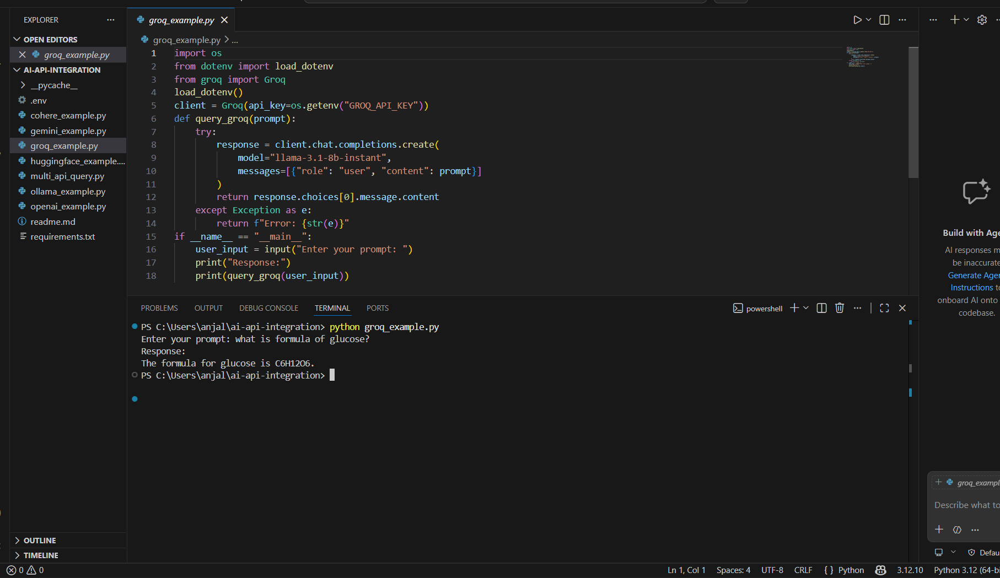
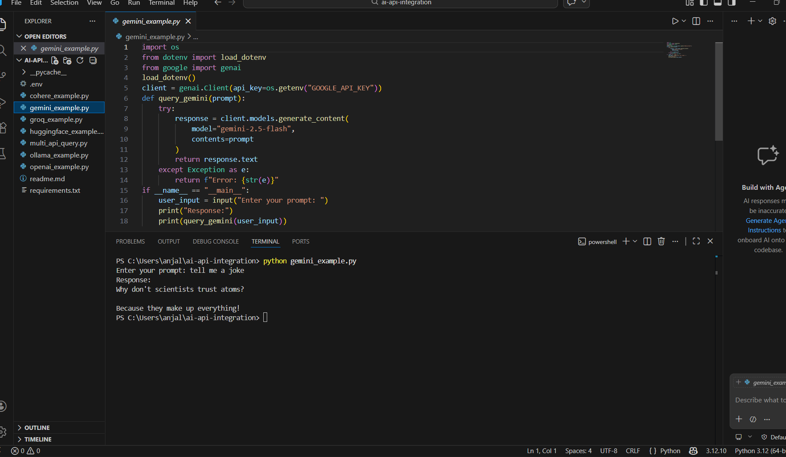
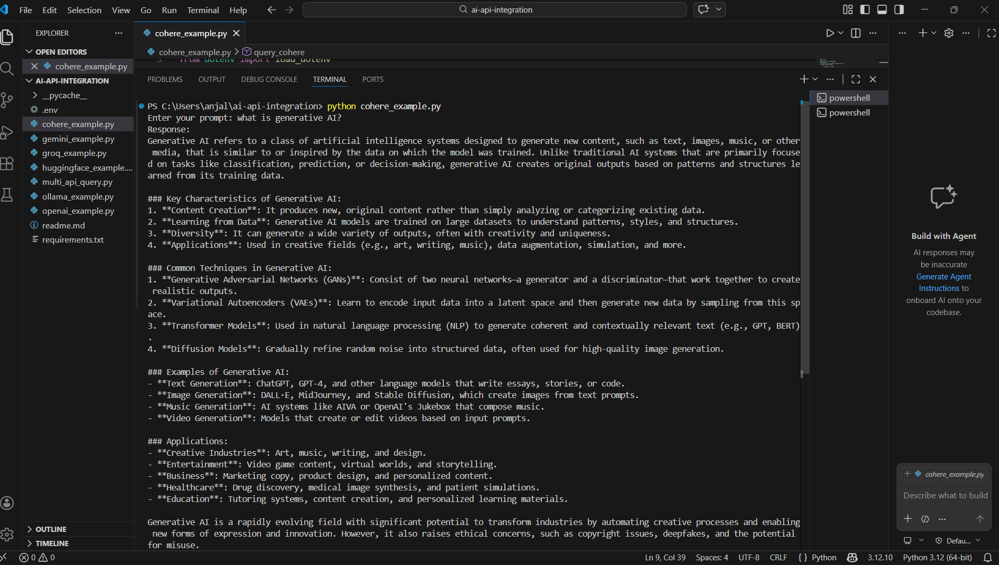
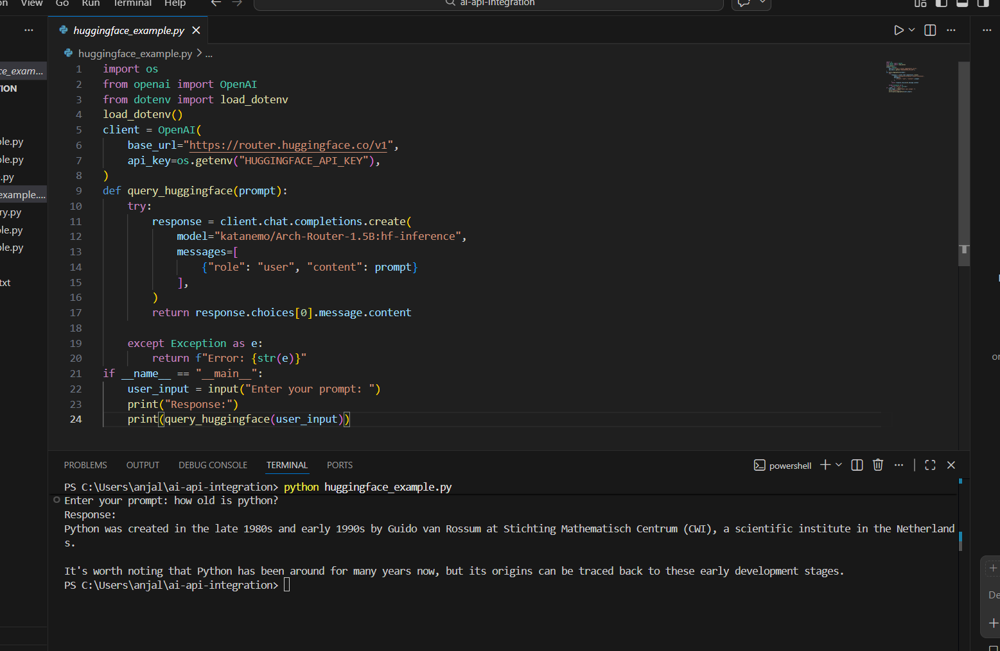
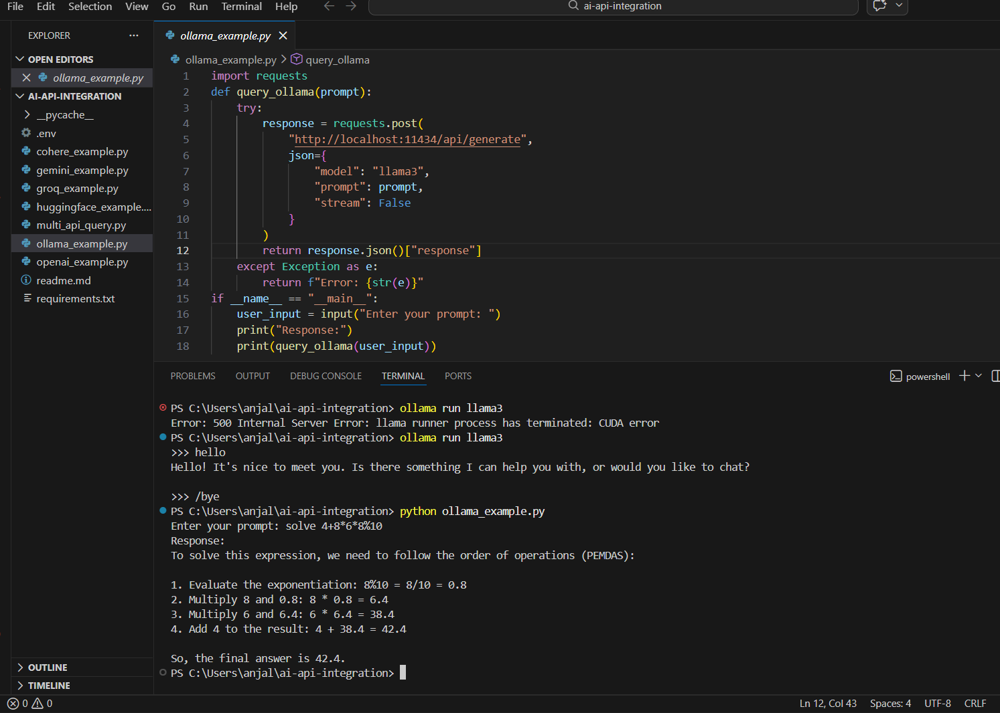
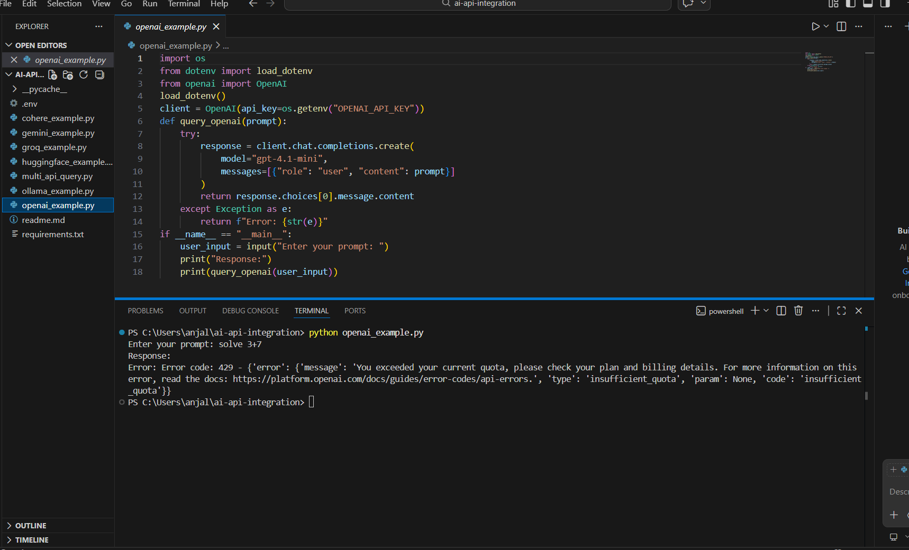
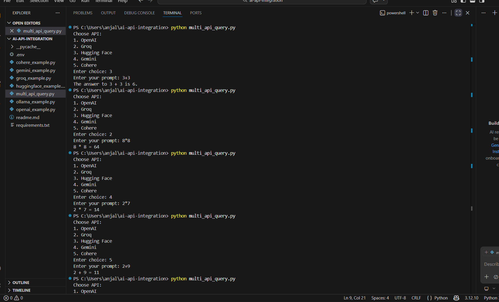

# AI API Integration Assignment

## Project Description
This project demonstrates how to integrate multiple Generative AI APIs using Python.  
Each API is implemented in a separate Python file, allowing users to input prompts and receive AI-generated responses.

The following AI providers are included:
- OpenAI
- Groq
- Ollama
- Hugging Face
- Google Gemini
- Cohere

Each program:
- Accepts user input
- Sends request to API
- Displays response
- Handles errors using try-except
- Uses environment variables for API keys

---

## Setup Instructions

### 1. Clone the Repository
```bash
git clone https://github.com/ANJALI99-STACK/Gen-AI-Assignment-2.git
cd Gen-AI-Assignment-2
```

### 2. Install Dependencies

```bash
pip install -r requirements.txt
```

### 3. Create `.env` File

Create a `.env` file in the root folder and add your API keys:

```
OPENAI_API_KEY=your_key_here
GROQ_API_KEY=your_key_here
HUGGINGFACE_API_KEY=your_key_here
GOOGLE_API_KEY=your_key_here
COHERE_API_KEY=your_key_here
```
---

## How to Obtain API Keys

### OpenAI

* Visit: [https://platform.openai.com/](https://platform.openai.com/)
* Sign up and go to API Keys section
* Note: May require billing to use

### Groq

* Visit: [https://console.groq.com/](https://console.groq.com/)
* Create account and generate API key

### Ollama

* Download from: [https://ollama.ai/](https://ollama.ai/)
* Install and run locally
* no API key required

### Hugging Face

* Visit: [https://huggingface.co/](https://huggingface.co/)
* Go to Settings → Access Tokens
* Create a token with read permissions

### Google Gemini

* Visit: [https://makersuite.google.com/app/apikey](https://makersuite.google.com/app/apikey)
* Generate API key

### Cohere

* Visit: [https://dashboard.cohere.com/](https://dashboard.cohere.com/)
* Create account and copy API key

---

## How to Run Each Program

Run any Python file using:

```bash
python filename.py
```

Examples:

```bash
python openai_example.py
python groq_example.py
python huggingface_example.py
python gemini_example.py
python cohere_example.py
```

Then:

* Enter your prompt
* View the AI response in terminal

---

## Screenshots of Working Programs

Screenshots are available in the `screenshots/` folder.

outputs included for:

* Groq API



* Gemini API



* Cohere API



* HuggingFace API



* Ollama API



* OpenAI API



* Multi API Query


Note:
* OpenAI may not run due to quota limitations

---

## Author

- **Name:** Anjali
- **Course:** Generative AI

---
